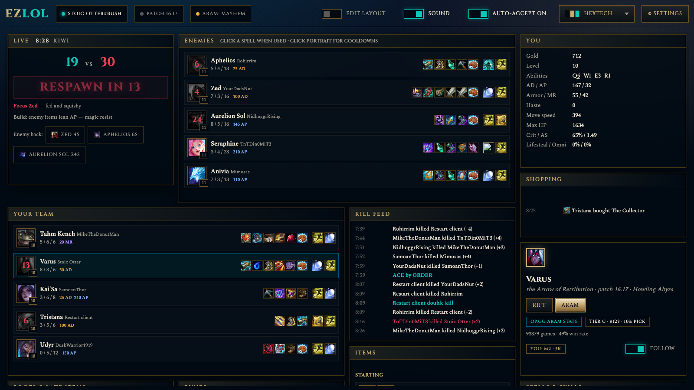
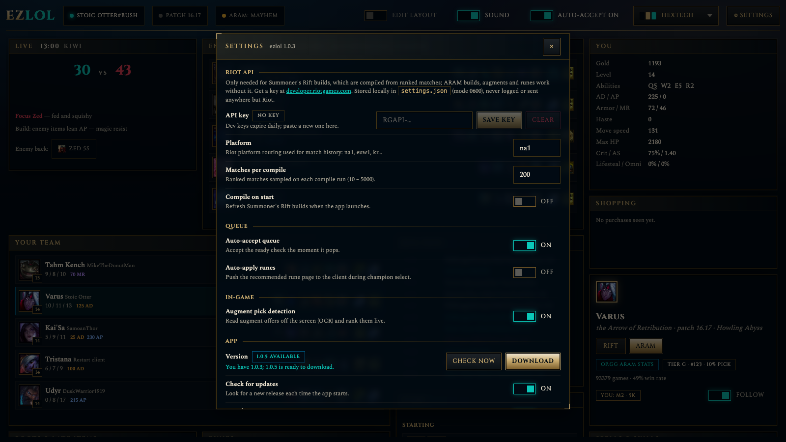
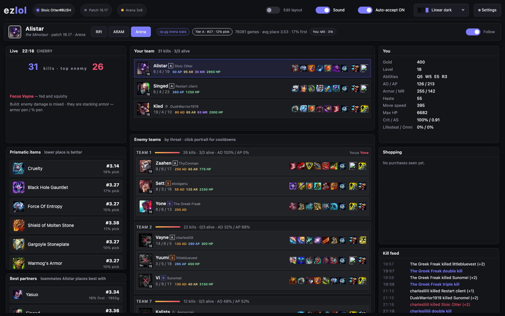
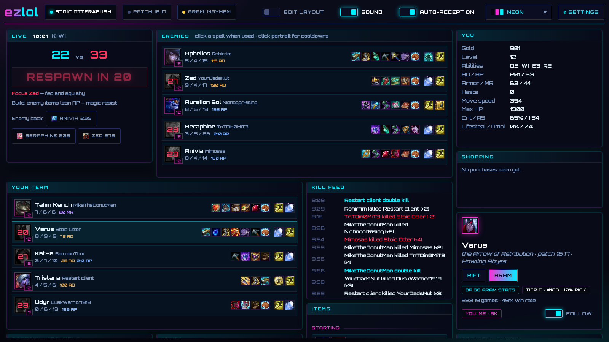
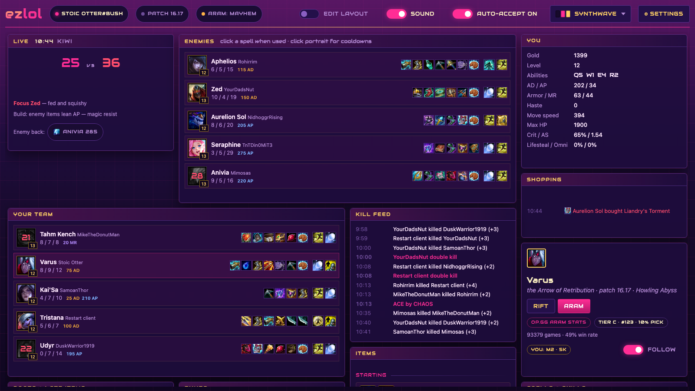
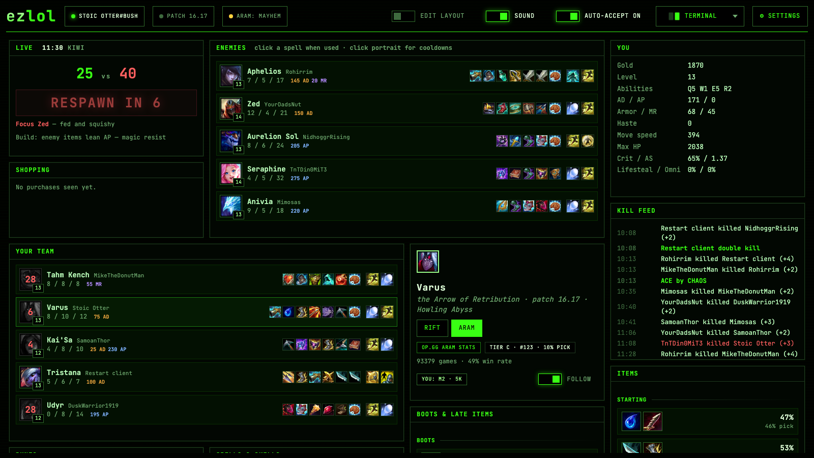
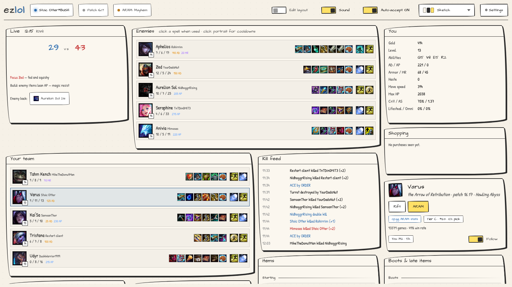

# ezlol

Local companion app for League of Legends: auto-accept, live game intel, builds for every mode, and a desktop app that keeps itself up to date.

1. **Queue watcher** – polls the League client and auto-accepts the ready check the moment your queue pops.
   Sound cue and desktop notification on pop and on champ select. Today's win/loss tally and streak.
2. **Champ select** – your team and the enemy team with damage profile (AD/AP), comp shape (tanks, ranged,
   CC, toughness) and what your comp is missing. Bench ranked by your mastery, recent record and what the
   team needs, with one-click swap, reroll and trade. **Apply** writes any rune page into the client and
   selects it; **Auto runes** does that for whatever champion you end up with.
3. **Live game** (in-game Live Client Data, no key) – scoreboard for both teams, item-derived AD/AP/armor/MR per
   player, "what to build" threat tip, enemy summoner-spell cooldown tracker (click when they use it), death
   timers, numbers-advantage banner, focus-target suggestion, enemy ability cooldowns (click a portrait),
   item purchase feed, kill feed, your stats and gold.
4. **Builds** – current-patch build for any champion and mode: Summoner's Rift by lane and ARAM, plus
   ARAM Mayhem augment tiers. Starting items, core build order, boots, late items, runes, summoner spells,
   skill order and full level path, win/pick rates. Follows your pick in champ select and your champion in
   game. Shows your mastery, recent record and Riot's playstyle pips. Summoner's Rift games also get
   objective timers and a lane-matchup box with the opponent's ability cooldowns.
5. **Augment picks (macOS)** – when an ARAM Mayhem augment selection is due (game start, levels 7/11/15) ezlol
   OCRs the screen, recognises the three offered augments and tells you which to take, ranked by your champion's
   win rate. Needs Screen Recording permission (System Settings → Privacy & Security) for ezlol / your terminal.
6. **Arena** – the live screen regroups the lobby into its teams (derived from kill assists, since the game
   API reports everyone as one team): your trio/duo, every enemy team ranked by threat with AD/AP split and
   items, plus Arena builds from op.gg (prismatic items, best partners, augment stats by average placement)
   and the same on-screen augment pick assist ranked by placement.
7. **Post-game** – full scoreboard with damage, gold and items as soon as the client has it.
8. **Electron shell** – native macOS/Windows window with self-update.

Go backend, Vue 3 frontend, single binary. Everything runs on `127.0.0.1`; nothing leaves your machine except
read-only requests to Riot's CDN, community stat sites and, optionally, the Riot API.

## Screenshots

| Dashboard (Hextech theme) | Settings |
|---|---|
|  |  |

| Linear dark | Neon | Synthwave |
|---|---|---|
|  |  |  |

| Terminal | Sketch |
|---|---|
|  |  |

## Install

Grab the latest build from [Releases](https://github.com/aarlint/ezlol/releases): `.dmg` for macOS
(Apple Silicon `arm64` or Intel `x64`), `.exe` installer or portable for Windows. Builds are unsigned, so:

- macOS: after copying to Applications run `xattr -cr /Applications/ezlol.app` once, or right-click → Open.
- Windows: click "More info → Run anyway" on the SmartScreen prompt.

Start it before or after the League client; it reconnects on its own.

## Build from source

```bash
make build      # builds the UI, embeds it, produces bin/ezlol
./bin/ezlol     # listens on http://127.0.0.1:7331 and opens your browser
make app        # run the Electron shell against bin/ezlol
```

Requires Go 1.26+ and Node 22+. CI (`.github/workflows/build.yml`) runs vet/tests, then builds macOS
arm64/x64 and Windows x64 desktop apps; pushing a `v*` tag publishes them as a GitHub release.

## How it works

### Queue watcher

The League client exposes a local HTTPS API (the LCU). ezlol reads the port and password from the client's
`lockfile` (or the `LeagueClientUx` process arguments), polls `/lol-gameflow/v1/gameflow-phase` once a second,
and when the phase is `ReadyCheck` with no response yet it POSTs `/lol-matchmaking/v1/ready-check/accept`.
Auto-accept is on by default and can be toggled in the UI. Every phase change and accept is logged in the
Events panel and streamed to the UI over Server-Sent Events.

### Builds

Two data sources, merged:

| Source | Needs | Gives |
|---|---|---|
| **op.gg Arena stats** (`/champions/arena/{id}`) + **blitz.gg Arena augment stats** | nothing | Arena: items, prismatic items, best partners, champion-specific augment placements; global augment tiers per stage. |
| **Riot in-client recommendations** (LCU `/lol-perks/v1/recommended-pages/...`) | League client running | Rune pages and summoner spells Riot recommends for the champion/role, Summoner's Rift (map 11) or Howling Abyss (map 12). Always available. |
| **op.gg ARAM stats** (`lol-api-champion.op.gg`, ~8.5M games/patch) | nothing | ARAM: starting items, core build, boots, 4th–6th options, rune pages, spells, skill order + full level path, win/pick rate, tier/rank. Cached 3 h. |
| **aramgg.com Mayhem augments** + CommunityDragon icons + blitz.gg descriptions | nothing | ARAM Mayhem augment win/pick rate and tier per champion (Tencent CN + client uploads), grouped by rarity. Cached 6 h. |
| **Compiled from ranked matches** (Riot API match-v5) | `RIOT_API_KEY` | Summoner's Rift: starting items, core build order, boots, 4th–6th item options, rune pages with win rates, spells, skill max order, per-role game counts. |

There is no free public build API, so ezlol compiles its own. With a key set, click **Compile ranked** or
**Compile ARAM** in the Build data panel (or start with `-auto-compile`). It pulls Challenger and Grandmaster
players' matches in that queue for your platform, folds every participant into per-champion/per-role aggregates, and saves them under
the data directory as `builds/<patch>.json`. Each run adds new matches only; run it again over the patch to
grow the sample. Item build order and skill order come from match timelines, so a run is two API calls per match.

Development keys (from https://developer.riotgames.com) allow 100 requests per 2 minutes and expire every 24
hours; ezlol respects both limits and backs off on 429. A 200-match run is roughly 400 requests.

Static data (champion, item, rune and spell names and images) comes from Data Dragon and is cached under
`ddragon/<version>/` in the data directory. It is refreshed daily.

## Augment ratings

Augment boxes carry an S / A / B / C / D pip. The letter comes from ezlol's own ranking, not the data
source: ARAM Mayhem augments are ordered by win rate (samples under 200 games are unrated and show
`?`), Arena augments by average placement, and the letter is the augment's rank within its rarity
(top 12 % S, next 23 % A, next 30 % B, next 20 % C, rest D). The order and the letter therefore always agree.

## Dashboard

The champion card (portrait, Rift / ARAM / Arena and lane buttons, tier, your mastery and record, **Follow**)
is a fixed bar under the header on every screen; it never moves. Click the portrait or name to open the
champion picker as a dropdown: type to search, Enter picks the first match, sort by name or by your mastery.
During champion select a second fixed strip appears under it with your team (trades), the enemy picks,
the ARAM bench with Swap / Reroll, and the comp read-outs; it disappears when the game starts. Everything below it is a widget on a 12-column grid. Flip **Edit layout** in the header to drag boxes around and
resize them from the corner; the arrangement is remembered per screen (lobby, champ select, and in game
for Rift, ARAM and Arena separately). Each screen ships with a symmetrical 3 | 6 | 3 column default: live
scoreboards and team boxes in the middle, status and augments on the left, you / shopping / kill feed on the right.
**Save layout** snapshots the current arrangement for that screen; **Reset** returns to that snapshot (or to
the built-in arrangement if you never saved one); **Forget saved** drops the snapshot. Boxes scroll internally when their content is taller than the widget. In edit mode every box the
screen *can* show, including ones that only appear later (bench in ARAM, enemy picks, Arena teams, augments…),
is offered as a dashed ghost slot: place it once and the real box drops into that spot when it shows up, so
nothing shifts mid-game. Boxes keep their exact positions; gaps are allowed.

## Desktop app

The installed app adds a **Desktop** section to Settings: **Launch at login** registers ezlol as a login
item, and **Start in the tray** (menu bar on macOS) starts it hidden behind a tray icon whose menu
opens the window, flips both options and quits. Closing the window in tray mode keeps the watcher
running, so queue pops are still accepted. Launching ezlol a second time just brings the window back.

## Themes

Themes, switchable from the header dropdown (persisted): **Hextech** (classic League: gold frames, Cinzel
headings, glow), **Linear dark** (flat neutral surfaces, indigo accent, rounded, system font), **Neon**
(cyberpunk cyan/magenta glow, Orbitron), **Synthwave** (purple night, pink and yellow, grid horizon),
**Terminal** (green phosphor on black, JetBrains Mono, scanlines) and **Sketch** (paper and ink, hand-drawn
wobbly borders, handwriting fonts). Every colour, radius, font, button, switch and heading style is a CSS token on `:root`; a theme is just a
`:root[data-theme="…"]` block that overrides them (see `web/src/style.css`).

## Settings and updates

The ⚙ **Settings** dialog (any mode) holds everything user-facing: Riot API key (masked; stored in
`settings.json` in the data directory with mode 0600, never logged), platform, matches per compile, compile on
start, auto-accept, augment pick detection, update checks, sounds, auto runes.

Updates: the app checks GitHub releases on start and every six hours. **Windows** self-updates through
electron-updater (background download, "Install & restart"). **macOS** self-updates through ezlol's own
updater because the builds are unsigned: it downloads the zip for your CPU, verifies it against
`SHA256SUMS.txt`, strips the quarantine flag, swaps `ezlol.app` in place (the folder must be writable by
you, e.g. `/Applications` or `~/Applications`) and relaunches. To get rid of the Gatekeeper prompt and use
in-place updates on macOS too, sign and notarize the builds: see [docs/SIGNING.md](docs/SIGNING.md) (five
repository secrets; CI does the rest).

## Configuration

Flags or environment variables (override the saved settings for that run):

| Flag | Env | Default | |
|---|---|---|---|
| `-addr` | `EZLOL_ADDR` | `127.0.0.1:7331` | Listen address. Keep it on loopback. |
| `-data` | `EZLOL_DATA_DIR` | `~/Library/Application Support/ezlol` | Cache and compiled builds. |
| `-platform` | `EZLOL_PLATFORM` | `na1` | Riot platform used for compiling (`euw1`, `kr`, ...). |
| `-matches` | `EZLOL_MATCHES_PER_RUN` | `200` | New matches per compile run. |
| | `RIOT_API_KEY` | | Ranked compile key; saved into settings.json for later runs. Never logged. |
| `-auto-compile` | `EZLOL_AUTO_COMPILE` | off | Start a compile run on boot. |
| `-no-open` | `EZLOL_NO_OPEN` | off | Do not open the browser. |
| `-dev` | `EZLOL_DEV` | | Proxy the UI to a Vite dev server, e.g. `http://localhost:5173`. |
| | `EZLOL_LOCKFILE` | | Override the League lockfile path (non-default install). |

Store the key in credvault (`credvault set RIOT_API_KEY`, reads stdin) and launch with the credvault
secret token for `RIOT_API_KEY` in the environment assignment so the value never touches shell history:

```bash
RIOT_API_KEY={{SECRET:RIOT_API_KEY}} ./bin/ezlol
```

## Development

```bash
make dev                    # backend, proxying the UI to Vite
cd web && npm run dev       # Vite with HMR on :5173, /api proxied to :7331
make test
```

Layout:

```
cmd/ezlol           entrypoint, flags, wiring
internal/lcu        League client discovery + REST client
internal/watcher    poll loop, auto-accept, event hub
internal/ddragon    Data Dragon loader and disk cache
internal/builds     match ingest, aggregate store, Riot compiler, display resolver
internal/api        HTTP API, SSE, embedded UI
web/                Vue 3 + Vite frontend (embedded into the binary at build time)
```

API:

```
GET  /api/status                      watcher snapshot + recent events
GET  /api/events                      SSE: status, log
POST /api/auto-accept  {"enabled":b}  toggle
POST /api/accept                      accept the current ready check
GET  /api/champions                   champion list (Data Dragon)
GET  /api/champions/{key}/build?role= merged build for a champion
GET  /api/champions/{key}/info        Riot tactical + playstyle info (from the client)
GET  /api/champselect                 champ select: teams, bench (ranked), comp analysis
POST /api/champselect/swap/{id}       swap with a bench champion
POST /api/champselect/reroll          spend a reroll
GET  /api/live                        in-game scoreboard from the Live Client Data API
GET  /api/eog                         post-game stats block
GET  /api/me/{id}?mode=aram|sr        your mastery + recent record on a champion
GET  /api/session                     today's games, wins, losses
GET  /api/champions/{key}/spells      ability cooldowns per rank (Data Dragon)
POST /api/runes/apply                 write a rune page into the client and select it
POST /api/champselect/trade/{id}      request (or ?accept=1 accept) a champion trade
GET  /api/builds/status               key present, compile progress, compiled patches
POST /api/builds/compile?queue=ranked|aram   start a compile run
POST /api/builds/compile/stop         cancel it
```

## Electron

```bash
make app     # run the desktop shell against bin/ezlol
make dmg     # package ezlol.app + .dmg into electron/dist
```

The shell spawns `bin/ezlol` (or reuses one already listening on 7331), sandboxes the renderer, and opens
external links in the system browser. Closing the window keeps the watcher alive in the Dock; Cmd+Q quits both.
Electron keeps its own profile in `~/Library/Application Support/ezlol-app`, separate from the backend's data
directory.

## Security notes

- The LCU and the in-game Live Client Data API both present self-signed certificates on loopback; verification
  is disabled for those two loopback clients only.
- The server binds to loopback and sets CSP, `X-Frame-Options: DENY` and `nosniff`. Images are allowed from
  `ddragon.leagueoflegends.com` only.
- The Riot key is read from the environment, sent only in the `X-Riot-Token` header to `*.api.riotgames.com`,
  and never persisted or logged.
- `typescript` is pinned to 5.x because `vue-tsc` 3.3 does not support TypeScript 7.
